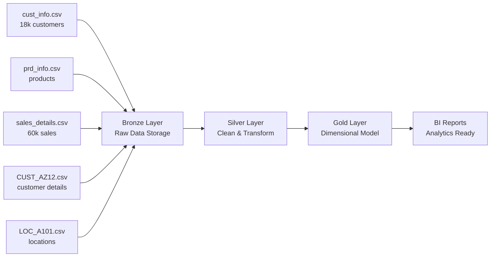

# SQL Data Warehouse from Scratch

This repository contains scripts and sample data to build a simple **Medallion architecture** data warehouse in SQL Server. It demonstrates how to ingest CSV extracts from two operational systems (CRM and ERP) into a "Bronze" layer and lays the foundation for "Silver" and "Gold" layers.

## Repository Structure

- **datasets/** – Sample CSV files organised under `source_crm` and `source_erp`.
- **scripts/** – SQL scripts to initialise the database, create Bronze tables and load data.
- **docs/** – Background documentation including naming conventions, source analysis and an architecture diagram.
- **datasets.rar** – Archived copy of the sample data.
- **SQL Data Warehouse Project Plan.pdf** – High‑level project plan (PDF).

## Quick Start

1. Install SQL Server (2019 or later) and ensure you can run T‑SQL scripts.
2. Run `scripts/initialize_sql_server_DWH.sql` to create the `MedallionDW` database and schemas (`bronze`, `silver`, `gold`).
3. Run `scripts/bronze_ddl.sql` to create raw tables in the `bronze` schema.
4. Execute the stored procedure defined in `scripts/p_load_bronze.sql` providing the absolute path to the `datasets` folder:
   ```sql
   EXEC dbo.load_bronze @DataRoot = 'C:\Imports\sql_DW_from_scratch\datasets';
   ```
   The procedure truncates existing rows and bulk loads all CSV files, printing a short preview and timing metrics.
5. Run `scripts/silver_ddl.sql` to create typed tables in the `silver` schema.
6. Execute `scripts/p_load_silver.sql` to transform Bronze data into the Silver layer.
7. Run `scripts/gold_ddl.sql` to create dimension and fact tables under `gold`.
8. Execute `scripts/p_load_gold.sql` to populate the analytics-ready tables.

## Architecture Overview

### Medallion Layers



## Data Samples

Example rows from the CRM `cust_info.csv` file:

```
cst_id,cst_key,cst_firstname,cst_lastname,cst_marital_status,cst_gndr,cst_create_date
11000,AW00011000, Jon,Yang ,M,M,2025-10-06
11001,AW00011001,Eugene,Huang  ,S,M,2025-10-06
```

ERP `CUST_AZ12.csv` sample:

```
CID,BDATE,GEN
NASAW00011000,1971-10-06,Male
NASAW00011001,1976-05-10,Male
```

These files contain tens of thousands of rows (e.g. `cust_info.csv` has ~18k rows and `sales_details.csv` around 60k rows).

## Documentation

- `docs/naming_conventions.md` describes naming standards for schemas, tables, columns and stored procedures.
- `docs/source_analysis.md` lists questions and guidelines for ingesting the CRM and ERP files and outlines the Bronze/Silver/Gold process.
- `docs/Documentation of My reasoning.md` explains why a Medallion architecture was chosen.
- `docs/data-architechture.png` provides a high‑level diagram of the planned layers.
- `docs/silver_gold_design.md` documents the approach taken for the new Silver and Gold scripts.
- `docs/bronze/README.md` illustrates the Bronze architecture.
- `docs/silver/README.md` illustrates the Silver architecture.
- `docs/gold/README.md` illustrates the Gold architecture.

## How to Proceed

With scripts now provided for all three layers, next steps focus on
automation and quality control:

1. **Schedule Loads** – Use SQL Agent, Airflow or Azure Data Factory to run the
   `load_bronze`, `load_silver` and `load_gold` procedures regularly.
2. **Implement Tests** – Add unit tests and data quality checks to ensure row
   counts and schema expectations are met.
3. **Expand Transformations** – Enhance the Silver and Gold procedures with
   de-duplication, slowly changing dimension logic and audit logging.
4. **Documentation & Version Control** – Continue updating the docs directory
   and keep all SQL scripts under version control for reproducibility.


