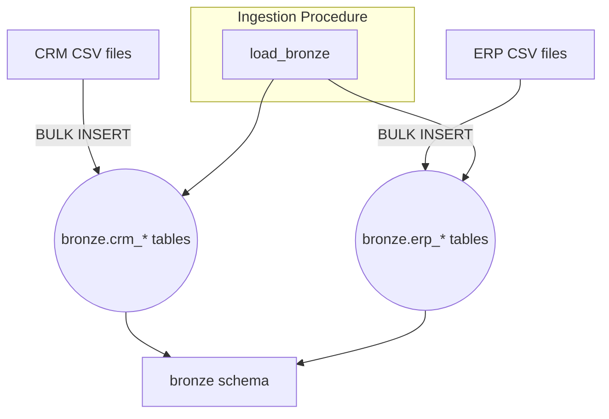

# Bronze Layer Architecture

The Bronze layer stores raw copies of the CSV files exactly as received. It serves as the persistent staging area and system of record.

The `load_bronze` stored procedure truncates each target table and bulk loads all files from the `datasets` folder, printing a preview and timing metrics.
