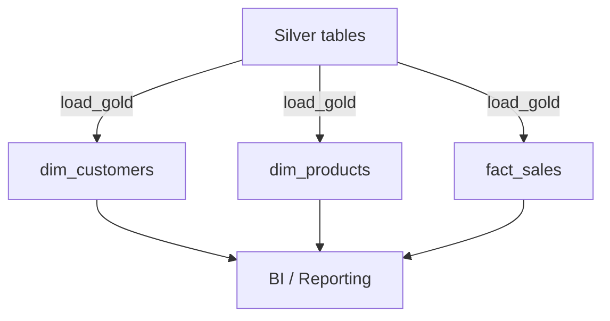

# Gold Layer Architecture

The Gold layer presents curated tables optimised for analytics. Dimensions and fact tables are built from the cleansed Silver layer.

`load_gold` refreshes the dimensions and facts by joining and aggregating the Silver tables. Surrogate keys are generated for efficient star-schema joins.
