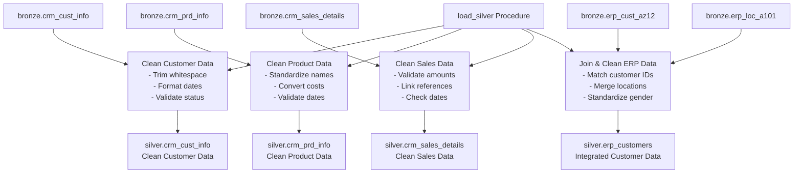

# Silver Layer Architecture

The Silver layer contains cleansed and conformed tables. Data is typed, trimmed and lightly transformed from the raw Bronze layer.

The `load_silver` procedure truncates each Silver table then inserts rows from Bronze, applying simple conversions and joins (e.g. ERP customer location data).
